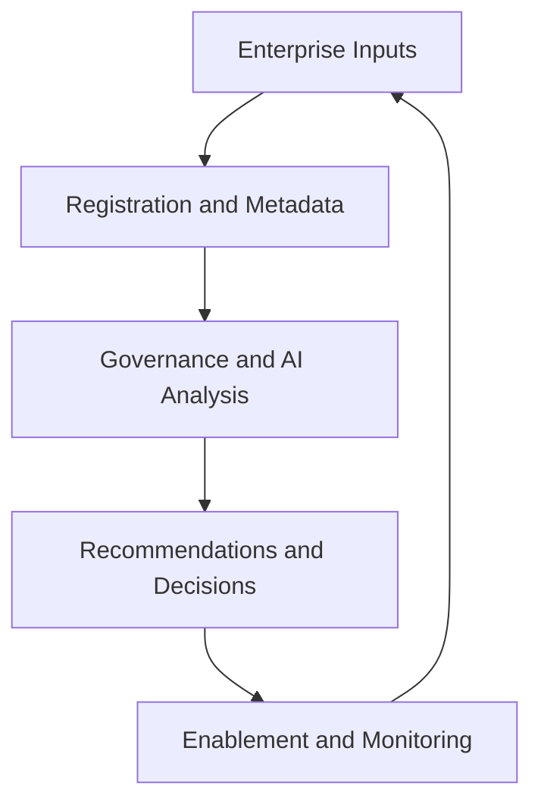

# CONNECT Outcome Flow

```mermaid
flowchart TD
  IN[Enterprise Inputs]
  REG[Registration and Metadata]
  GOV[Governance and AI Analysis]
  DEC[Recommendations and Decisions]
  EN[Enablement and Monitoring]

  IN --> REG --> GOV --> DEC --> EN
  EN --> IN
```
