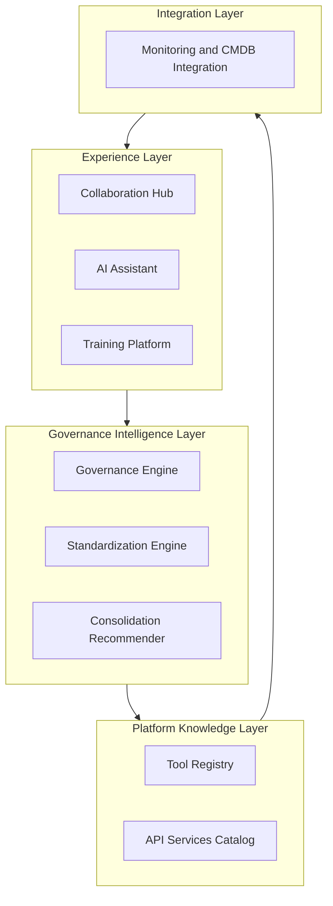

# CONNECT System Layers

```mermaid
flowchart TB
  subgraph Experience["Experience Layer"]
    CH[Collaboration Hub]
    AI[AI Assistant]
    TP[Training Platform]
  end

  subgraph Governance["Governance Intelligence Layer"]
    GE[Governance Engine]
    SE[Standardization Engine]
    CR[Consolidation Recommender]
  end

  subgraph Knowledge["Platform Knowledge Layer"]
    TR[Tool Registry]
    AC[API Services Catalog]
  end

  subgraph Integration["Integration Layer"]
    CM[Monitoring and CMDB Integration]
  end

  Experience --> Governance
  Governance --> Knowledge
  Knowledge --> Integration
  Integration --> Experience
```
