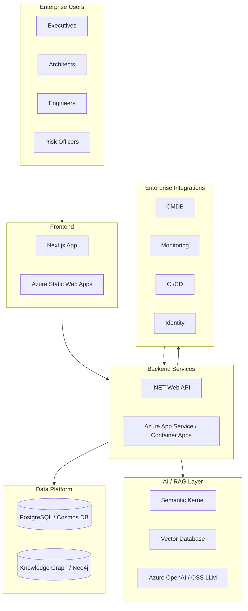

# CONNECT Target MVP Stack

```mermaid
flowchart TB
  subgraph Users["Enterprise Users"]
    EX[Executives]
    AR[Architects]
    EN[Engineers]
    RC[Risk Officers]
  end

  subgraph Frontend["Frontend"]
    NX[Next.js App]
    SWA[Azure Static Web Apps]
  end

  subgraph Backend["Backend Services"]
    API[.NET Web API]
    ACS[Azure App Service / Container Apps]
  end

  subgraph Data["Data Platform"]
    DB[(PostgreSQL / Cosmos DB)]
    KG[(Knowledge Graph / Neo4j)]
  end

  subgraph AI["AI / RAG Layer"]
    SK[Semantic Kernel]
    VDB[Vector Database]
    LLM[Azure OpenAI / OSS LLM]
  end

  subgraph External["Enterprise Integrations"]
    CMDB[CMDB]
    MON[Monitoring]
    CICD[CI/CD]
    ID[Identity]
  end

  Users --> Frontend
  Frontend --> Backend
  Backend --> Data
  Backend --> AI
  Backend --> External
  External --> Backend
```
