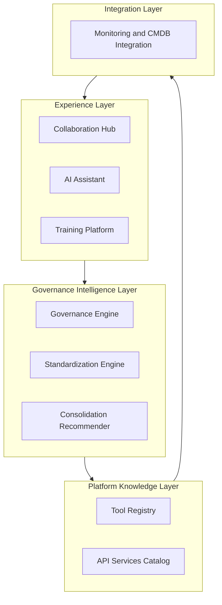
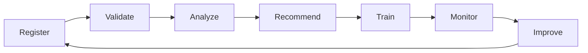
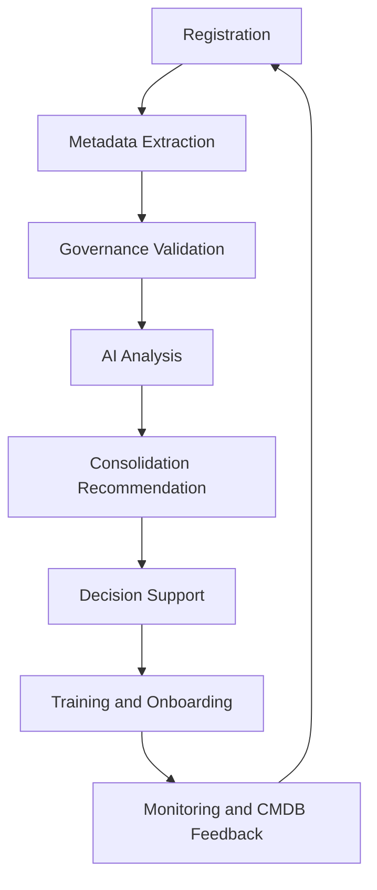
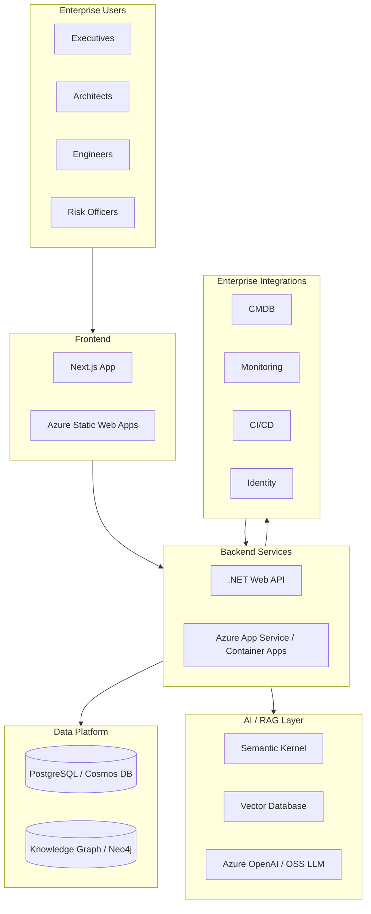

# CONNECT Framework Architecture Overview

## Purpose

CONNECT Framework combines governance, inventory intelligence, AI-assisted analysis, and continuous feedback into a modular architecture that can evolve from a documentation-first foundation to a full enterprise platform MVP.

## System Layers

CONNECT is organized into four logical layers:

1. **Experience Layer** — Collaboration Hub, AI Assistant, Training Platform
2. **Governance Intelligence Layer** — Governance Engine, Standardization Engine, Consolidation Recommender
3. **Platform Knowledge Layer** — Tool Registry, API Services Catalog
4. **Integration Layer** — Monitoring and CMDB Integration

Source: `diagrams/system-layers.md`

## Closed-Loop Governance Model

Source: `diagrams/closed-loop-governance.md`

## High-Level Data Flow

Typical end-to-end flow:

1. **Register** tool, API, or platform metadata.
2. **Validate** required attributes and governance rule compliance.
3. **Analyze** overlap, risk, standards alignment, and adoption patterns.
4. **Recommend** consolidation, remediation, or adoption actions.
5. **Support decisions** with role-specific outputs.
6. **Train and onboard** teams based on approved standards and platform guidance.
7. **Monitor and feedback** using telemetry and CMDB updates to improve governance quality over time.

Source: `diagrams/processing-flow.md`

## Core Modules

### Collaboration Hub

Provides a shared space for architecture reviews, governance decisions, and cross-team alignment.

### Governance Engine

Evaluates policy rules, standards, ownership requirements, and lifecycle controls.

### Tool Registry

Maintains metadata for tools, APIs, platforms, owners, costs, risk indicators, and status.

### Standardization Engine

Maps implementation artifacts to enterprise standards and highlights non-compliant patterns.

### Consolidation Recommender

Detects overlap across tools and platform services, then proposes rationalization options.

### AI Assistant

Generates role-specific summaries, recommendations, and governance explanations.

### Training and Onboarding Platform

Converts governance findings into guided onboarding and upskilling actions.

### Monitoring and CMDB Integration

Brings operational telemetry and configuration data into governance visibility.

### Platform Services API Catalog

Provides discoverability and governance metadata for reusable platform services.

## AI Role in the Architecture

AI in CONNECT is assistive and explainable, not fully autonomous control logic.

Primary AI contributions:

- metadata extraction and normalization
- classification of tools and platform capabilities
- duplicate and overlap detection
- standards and policy explanation
- risk scoring support
- recommendation generation with rationale
- executive, architect, and engineer summary generation
- training pathway suggestions based on governance outcomes

## Future MVP Architecture (Target)

Source: `diagrams/target-mvp-stack.md`

### Technology Summary

- **Frontend**: Next.js (React + TypeScript)
- **Backend**: .NET Web API services
- **Data layer**: PostgreSQL and/or Cosmos DB
- **Knowledge graph**: Neo4j or graph-capable alternative for relationship analysis
- **AI/RAG layer**: Semantic Kernel + vector database + Azure OpenAI or open-source LLM
- **Hosting**: Azure Static Web Apps (frontend), Azure App Service / Azure Container Apps (backend)

This staged approach allows organizations to adopt CONNECT incrementally while preserving a clear path to enterprise scale.

## Diagram Sources

All architecture diagrams are maintained in the repository `diagrams/` folder and mirrored on the public architecture page in `apps/web`.
