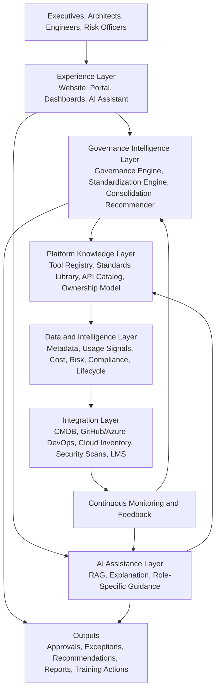
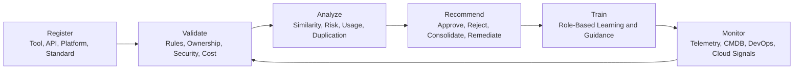
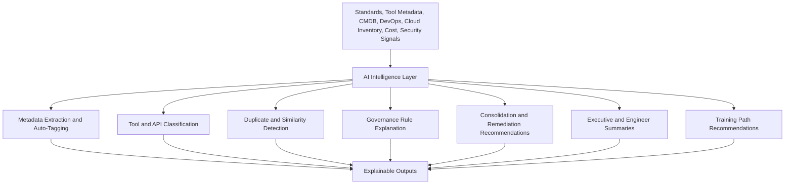
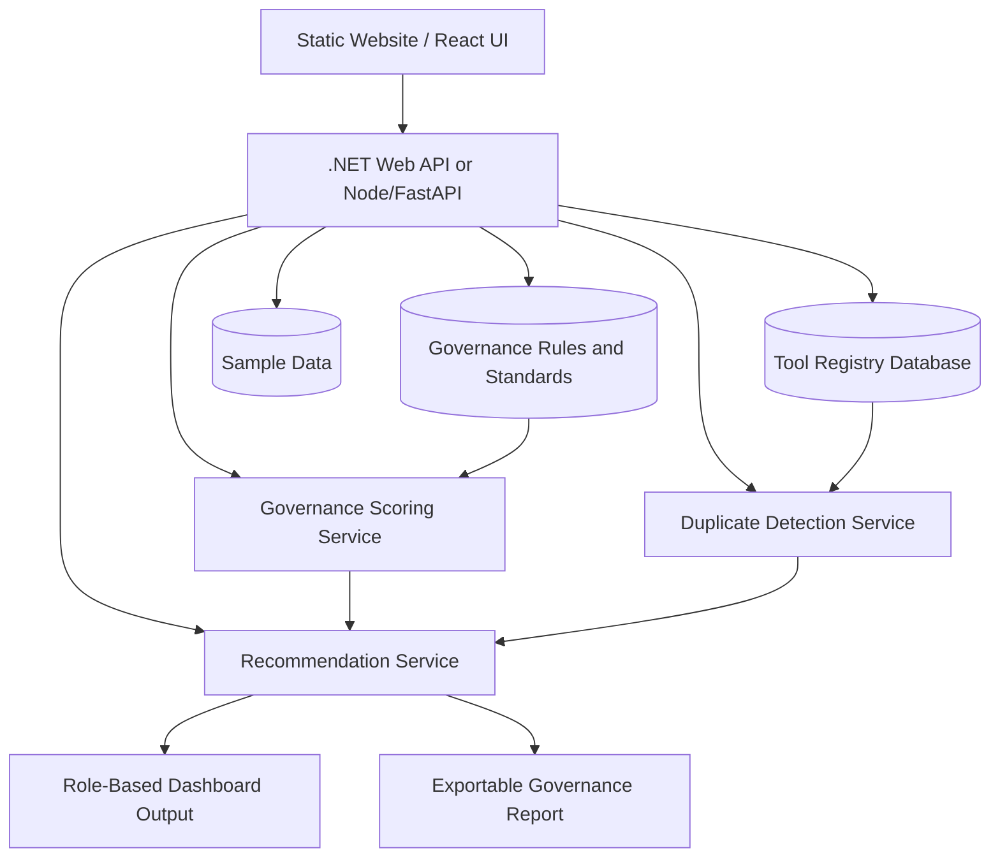
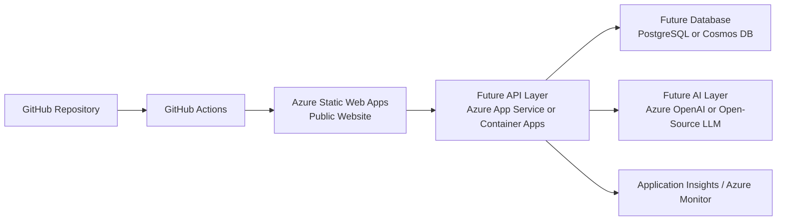

# CONNECT Framework Architecture Overview

CONNECT Framework is designed as an **AI-augmented enterprise governance and platform alignment system**. Its purpose is to help organizations move from static governance documents and manual reviews to a closed-loop operating model where tools, APIs, standards, platforms, owners, risks, costs, and training needs are continuously connected.

The architecture should be understandable by three audiences:

- **Organizations and executives** who need visibility into tool sprawl, cost, risk, and platform adoption.
- **Architects and governance teams** who need standards, approval workflows, exception handling, and auditability.
- **Engineers** who need fast, practical guidance on approved tools, patterns, APIs, and implementation standards.

---

## 1. Architecture Goals

CONNECT should support the following product goals:

1. Provide a central inventory of enterprise tools, APIs, platforms, owners, lifecycle states, and standards.
2. Validate tools, APIs, and delivery artifacts against governance rules.
3. Detect duplication, shadow IT, underused platforms, and non-standard technology adoption.
4. Generate explainable recommendations for different roles.
5. Link governance findings to practical engineering guidance and training.
6. Continuously monitor telemetry and CMDB data to keep governance context current.

---

## 2. High-Level Architecture

### Layer Summary

| Layer | Purpose | Main Capabilities |
|---|---|---|
| Experience Layer | Human-facing entry point | Website, dashboards, AI assistant, role-based views |
| Governance Intelligence Layer | Decision and validation logic | Policy validation, standards checks, exception routing, consolidation recommendations |
| AI Assistance Layer | Explainable guidance | Q&A, summaries, recommendations, RAG over standards, engineer guidance |
| Platform Knowledge Layer | Enterprise source of truth | Tool registry, standards library, API catalog, ownership graph |
| Data and Intelligence Layer | Decision context | Usage, cost, risk, compliance, lifecycle, adoption and dependency signals |
| Integration Layer | Enterprise connectivity | CMDB, DevOps, cloud inventory, LMS, security tools, monitoring |
| Continuous Feedback | Closed-loop improvement | Detect drift, update recommendations, trigger training and governance actions |

---

## 3. Closed-Loop Governance Flow

CONNECT should be built around a simple but powerful governance flow:

This makes CONNECT more than a documentation site. It becomes a repeatable operating model for enterprise alignment.

---

## 4. Core Product Modules

### 4.1 Collaboration Hub

The Collaboration Hub provides a common workspace for governance conversations, architecture review decisions, standards discussions, and cross-functional alignment. Over time, this can integrate with tools such as Teams, Slack, Jira, Azure DevOps, GitHub Issues, or ServiceNow.

### 4.2 Governance Engine

The Governance Engine evaluates tools, APIs, cloud resources, and engineering artifacts against defined rules. It should support:

- required ownership fields
- approved tool checks
- security classification checks
- architecture standards validation
- exception workflow routing
- approval history and audit trail

### 4.3 Tool Registry

The Tool Registry is the enterprise inventory baseline. It stores:

- tool name
- category
- owner
- business domain
- lifecycle status
- cost
- usage level
- compliance status
- risk level
- related APIs, teams, and systems

### 4.4 Standardization Engine

The Standardization Engine maps standards to implementation checks. In future versions, this can validate:

- API naming and versioning
- Azure resource naming and tagging
- Git branching and CI/CD standards
- secrets management practices
- logging and observability requirements
- documentation completeness

### 4.5 Consolidation Recommender

The Consolidation Recommender identifies overlap across tools, APIs, platforms, and services. It should consider:

- functional similarity
- adoption level
- annual cost
- lifecycle state
- compliance posture
- dependencies
- migration effort
- business criticality

### 4.6 AI Assistant

The AI Assistant should not be positioned as a generic chatbot. It should be a **governance-aware assistant** that explains rules, recommends approved alternatives, summarizes architecture findings, and creates role-specific guidance.

### 4.7 Training and Onboarding Platform

Governance findings should connect to learning actions. If an engineer or team repeatedly violates a standard, CONNECT can recommend targeted onboarding or training modules.

### 4.8 Monitoring and CMDB Integration

The monitoring layer keeps governance data current by integrating signals from CMDB, DevOps, cloud inventory, monitoring systems, cost reports, security scans, and API platforms.

### 4.9 Platform Services API Catalog

The API Catalog helps teams discover reusable services instead of creating duplicate APIs or platforms.

---

## 5. AI Role in the Architecture

AI should support decision-making, not replace accountability. The strongest AI use cases for CONNECT are:

### AI Responsibilities

| AI Capability | Product Value |
|---|---|
| Metadata extraction | Reduces manual intake effort |
| Auto-tagging | Improves registry consistency |
| Similarity detection | Finds duplicate tools, APIs, and platforms |
| Standards Q&A | Helps engineers apply standards correctly |
| Rule explanation | Builds trust in governance decisions |
| Recommendation generation | Provides actionable next steps |
| Role-specific summarization | Gives executives, architects, engineers, and risk officers the right level of detail |
| Training recommendation | Converts governance issues into learning actions |

---

## 6. Target MVP Architecture

The first working MVP should remain focused. Avoid trying to build the entire enterprise platform immediately.

### MVP Modules

| MVP Module | Why It Matters |
|---|---|
| Tool Registry | Establishes the product data foundation |
| Governance Rule Checker | Shows immediate value to engineers and architects |
| Duplicate Detection | Demonstrates cost and platform rationalization value |
| Recommendation Output | Converts findings into useful next steps |
| Role-Based Dashboard | Makes the same data useful to leaders and engineers |
| Exportable Report | Helps adoption conversations with organizations |

---

## 7. Azure Deployment View

### Cost-Conscious Hosting Strategy

- Start with **Azure Static Web Apps** for the website.
- Keep AI responses static or mocked during early public demo stages.
- Add a lightweight API only when interactive features are ready.
- Add Azure OpenAI or hosted open-source LLM only after the workflow value is proven.

---

## 8. Recommended Engineering Direction

For the next development phase, build the product in this order:

1. Static website and documentation.
2. Tool registry sample data.
3. Tool registration form.
4. Governance rule checker.
5. Similarity/duplicate detection using sample data.
6. Recommendation output with engineer and executive views.
7. Exportable governance report.
8. AI assistant using standards and governance rules as the knowledge base.

This keeps the product practical, reachable, and useful for organizations and engineers.
